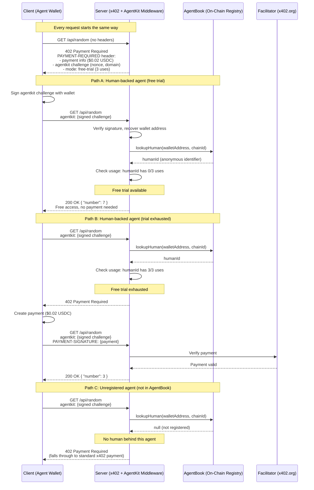

## What This Example Does

This is a paid API endpoint that returns a random number between 1 and 9. It costs $0.02 USDC per request on Base Sepolia. But there's a twist: if your agent is backed by a real, World ID-verified human, your first three calls are free. You don't need an API key, you don't need an account. Your agent signs a message with its wallet, the server checks the AgentBook — an on-chain registry of human-backed agents — and if your agent is registered there, the door opens. After three free calls, you pay like everyone else. If your agent isn't in the AgentBook at all, you pay from the start.

## Why Build This?

The "first call free" problem seems simple until you think about Sybil attacks. Anyone can generate wallets programmatically — infinite wallets means infinite free calls. AgentKit fixes this by tying wallet identity to **human identity** through World ID's biometric proof-of-personhood. One human = one identity, no matter how many wallets or agents they control.

Here's where this pattern shows up in the real world:

- **API onboarding** — You're launching a paid data API and want to let developers try it before they commit. With AgentKit, each real human gets 3 free calls to evaluate the service. Bots and scripts can't game it — every free trial maps to a verified human.

- **AI agent marketplaces** — You're building a service that AI agents consume. You want to reward human-operated agents over pure bots. Agents backed by a real person get a free trial, while unverified agents pay immediately. This creates a natural quality signal.

- **Freemium APIs with fair usage** — You want a generous free tier without abuse. Traditional rate limiting by IP or API key is trivially bypassed. Per-human rate limiting via World ID means your free tier is actually sustainable — each person gets exactly N free calls, period.

## Architecture

Here's the full request flow, showing all paths through the system:



## Setup

### Prerequisites

- Node.js 18+
- An EVM wallet (you'll use the one in `.env.local`)
- Base Sepolia testnet ETH + USDC for paid requests
- [World App](https://world.org/download) installed on your phone (for AgentBook registration)

### Step 1: Clone and install

```bash
git clone https://github.com/Must-be-Ash/world-x402-agentkit-example.git first-call-free
cd first-call-free
npm install
```

### Step 2: Configure environment

```bash
cp .env.example .env.local
```

Open `.env.local` and set your wallet keys:

```env
# Your agent's wallet
X402_WALLET_ADDRESS=0xYourWalletAddress
X402_WALLET_PRIVATE_KEY=0xYourPrivateKey

# How many free calls per human (default: 3)
AGENTKIT_FREE_USES=3
```

- **X402_WALLET_ADDRESS / X402_WALLET_PRIVATE_KEY** — the wallet your agent uses to sign agentkit challenges and make payments. This wallet needs to be registered in AgentBook (step 4) to get free calls.
- **AGENTKIT_FREE_USES** — how many free calls each human gets. This is per-human, not per-wallet. If one human controls 5 agents, they all share the same 3 free uses.

### Step 3: Fund your wallet

Get Base Sepolia testnet tokens for paid requests:

- **ETH** — use a Base Sepolia faucet
- **USDC** — use the [Circle USDC faucet](https://faucet.circle.com/) (select Base Sepolia)

You only need a small amount. Each request costs $0.02 USDC.

> **Note:** Funding is only needed for the paid path. If your agent is registered in AgentBook, your first 3 calls are free — no USDC required.

### Step 4: Register your agent in AgentBook

This is the critical step that makes "first call free" work. Your wallet needs to be tied to a World ID:

```bash
npx @worldcoin/agentkit-cli register 0xYourWalletAddress --network base --auto
```

The CLI will show a QR code. Scan it with World App to complete biometric verification. This is a one-time setup — once registered, your wallet is permanently in the AgentBook as a human-backed agent.

> **Skipping this step?** That's fine — the endpoint still works. Your agent just won't get free calls. It'll fall through to the standard x402 payment flow on every request. You can always register later.

### Step 5: Start the server

```bash
npm run dev
```

### Step 6: Test with curl

```bash
curl -i http://localhost:3000/api/random
```

Expected output:

```
HTTP/1.1 402 Payment Required
payment-required: eyJ4NDAyVmVyc2lvbi...
```

That `payment-required` header is a base64-encoded JSON object containing everything a client needs: payment details, the agentkit challenge, and the free-trial mode info. We'll decode it in a later section.

### Step 7: Run the tests

Three test scripts cover different scenarios:

```bash
# Just pay and get the number (no AgentKit needed)
npm run test:paid

# Quick check — sign agentkit challenge, try free access
npm run test:quick

# Full suite — 5 tests covering all paths
npm test
```

| Command | Script | What it tests | Needs AgentBook? |
|---------|--------|--------------|-----------------|
| `npm run test:paid` | `test-paid.ts` | Pay $0.02, get the number | No |
| `npm run test:quick` | `test-first-call-free.ts` | Sign agentkit challenge, try free access | Yes |
| `npm test` | `test-endpoint.ts` | Full suite: 402 structure, free access, trial exhaustion, unregistered agent, exhausted + payment | Yes (tests 2/3/5) |

Start with `npm run test:paid` to verify the endpoint and payment flow work. The other tests require your wallet to be registered in AgentBook first (step 4).

## The Middleware — Line by Line

The entire gate lives in `middleware.ts`. Let's walk through it.

### x402 resource server setup

This is the standard x402 boilerplate — same across every x402 app, with one key difference:

```typescript
const facilitatorClient = new HTTPFacilitatorClient({
  url: "https://x402.org/facilitator",
});

const resourceServer = new x402ResourceServer(facilitatorClient)
  .register("eip155:84532", new ExactEvmScheme())
  .registerExtension(agentkitResourceServerExtension);
```

You're telling x402: "I accept payments on Base Sepolia (`eip155:84532`), using the exact payment scheme, and I support the AgentKit extension." That last line — `registerExtension(agentkitResourceServerExtension)` — is what makes AgentKit work. It enriches every 402 response with the agentkit challenge (nonce, domain, supported chains, mode info).

### AgentKit setup — the identity layer

```typescript
const FREE_USES = parseInt(process.env.AGENTKIT_FREE_USES || "3", 10);

const agentBook = createAgentBookVerifier();
const storage = new InMemoryAgentKitStorage();

const hooks = createAgentkitHooks({
  storage,
  agentBook,
  mode: { type: "free-trial", uses: FREE_USES },
});
```

Three pieces working together:

- **`agentBook`** — a verifier that looks up wallet addresses in the AgentBook smart contract. Given a wallet address and chain ID, it returns the anonymous human identifier behind that wallet, or `null` if the wallet isn't registered.
- **`storage`** — tracks how many free calls each human has used, per endpoint. `InMemoryAgentKitStorage` resets on server restart. In production, you'd implement `AgentKitStorage` with a persistent backend.
- **`hooks`** — the magic. `createAgentkitHooks` returns a `requestHook` that handles the entire flow: challenge validation, signature verification, AgentBook lookup, usage counting, and free access bypass. You don't write gate logic — AgentKit IS the gate.

### Route config and extension declaration

```typescript
const routes = {
  "GET /api/random": {
    accepts: [
      {
        scheme: "exact" as const,
        price: "$0.02",
        network: "eip155:84532" as const,
        payTo,
      },
    ],
    extensions: declareAgentkitExtension({
      statement: "Verify your agent is backed by a real human for free access",
      mode: { type: "free-trial", uses: FREE_USES },
    }),
  },
};
```

This defines what the server advertises in the 402 response:

- **Price:** $0.02 USDC on Base Sepolia
- **AgentKit extension:** Tells clients "you can sign in with your wallet to prove you're human-backed." The `statement` is the human-readable message displayed when signing. The `mode` tells clients upfront: "first 3 calls are free for verified humans."

### The hook registration — where it all connects

```typescript
const httpServer = new x402HTTPResourceServer(resourceServer, routes)
  .onProtectedRequest(hooks.requestHook);
```

This single line registers AgentKit's request hook on every protected request. The hook runs *before* x402 checks payment and handles everything:

1. **No agentkit header?** Falls through — x402 sends the 402 response with the challenge.
2. **agentkit header present?** Validates the signature, recovers the wallet address.
3. **Wallet in AgentBook?** Looks up the anonymous human identifier.
4. **Human has free uses left?** Grants access — returns `{ grantAccess: true }`, bypassing payment entirely.
5. **Human exhausted free trial?** Falls through to x402 payment.
6. **Wallet not in AgentBook?** Falls through to x402 payment.

> **This is the key difference from the SIWX examples.** In those, you write custom gate logic: parse header, verify signature, check condition, grant/deny. With AgentKit, you configure a mode and register the hook. The library handles the rest.

### The middleware export

```typescript
export const middleware = paymentProxyFromHTTPServer(httpServer);

export const runtime = "nodejs";

export const config = {
  matcher: ["/api/:path*"],
};
```

Standard Next.js middleware export. Every request to `/api/*` goes through the x402 + AgentKit pipeline.

## Understanding AgentKit

### What is AgentKit?

AgentKit is a proof-of-personhood layer for AI agents, built on [World ID](https://world.org). It answers a question that wallets alone can't: "Is there a real human behind this agent?"

Think of it like a membership club that checks biometrics at the door. Your wallet is your membership card — anyone can get one. But AgentKit checks that the card belongs to a real person who showed up and verified their identity. One person, one membership, no matter how many cards they carry.

### Why it matters for this example

The original "first call free" idea was scrapped because it's trivially gameable with plain wallets. Generate 1000 wallets, get 1000 free calls. AgentKit fixes this by making the identity unit a **human**, not a wallet:

- Alice registers 3 agents in AgentBook. They all share the same human ID.
- Alice's Agent A uses 2 free calls. Agent B has 1 left. Agent C has 0 left.
- Bob creates a fresh wallet. It's not in AgentBook. No free calls — he pays from the start.

### Two headers, two purposes

x402 with AgentKit uses two separate headers, and they do completely different things:

| Header | Purpose | Analogy |
|--------|---------|---------|
| `agentkit` | Proves human-backed identity | Showing your biometric membership card |
| `PAYMENT-SIGNATURE` | Authorizes a payment | Handing over cash |

The `agentkit` header proves *who you are* (or more precisely, that a verified human is behind your wallet). The `PAYMENT-SIGNATURE` header proves *you can pay*. You might send both on the same request — identity for tracking, payment for access — or just one at a time.

### The challenge-response flow

AgentKit works as a three-step dance:

**1. Server issues a challenge (in the 402 response):**

The server generates a unique nonce, sets an expiration, and includes a human-readable statement. This goes into the `agentkit` extension of the 402 response, along with the mode info (`free-trial`, 3 uses) so clients know what's available.

**2. Client signs the challenge:**

The wallet signs a structured SIWE (Sign-In with Ethereum) message containing the nonce, domain, URI, and statement. This proves the client controls the private key for that wallet address. The signed message goes into the `agentkit` header as a base64-encoded JSON payload.

**3. Server verifies and looks up the human:**

The server recovers the wallet address from the signature, validates the message (nonce, expiration, domain), then makes an on-chain call to the AgentBook contract: "Is this wallet registered? If so, who's the human behind it?" If the lookup returns a human ID, the server checks usage counts and grants or denies free access.

### The agentkit payload structure

Here's what's inside the `agentkit` header after the client signs (decoded from base64):

```json
{
  "domain": "localhost",
  "address": "0xAbF01df9428EaD5418473A7c91244826A3Af23b3",
  "statement": "Verify your agent is backed by a real human for free access",
  "uri": "http://localhost:3000/api/random",
  "version": "1",
  "chainId": "eip155:84532",
  "type": "eip191",
  "nonce": "621681af48ab8ae01efb6ef346980cf3",
  "issuedAt": "2026-03-17T03:49:51.331Z",
  "resources": ["http://localhost:3000/api/random"],
  "signature": "0x..."
}
```

- **domain** — the server's domain (prevents replay attacks on other servers)
- **address** — the wallet claiming to sign
- **statement** — what the agent agreed to when signing
- **chainId** — which chain this signature is for (`eip155:84532` = Base Sepolia)
- **type** — signature type (`eip191` for EOA wallets, `eip1271` for smart wallets)
- **nonce** — one-time value from the server's challenge (prevents replay)
- **signature** — the cryptographic proof that this wallet signed this exact message

## Anatomy of the 402 Response

When you `curl http://localhost:3000/api/random`, the server returns a 402 with a `payment-required` header. Here's that header decoded:

```json
{
  "x402Version": 2,
  "error": "Payment required",
  "resource": {
    "url": "http://localhost:3000/api/random"
  },
  "accepts": [
    {
      "scheme": "exact",
      "network": "eip155:84532",
      "amount": "20000",
      "asset": "0x036CbD53842c5426634e7929541eC2318f3dCF7e",
      "payTo": "0xF7C645b7600Fb6AaE07Fd0Cf31112A7788BE8F85",
      "maxTimeoutSeconds": 300,
      "extra": {
        "name": "USDC",
        "version": "2"
      }
    }
  ],
  "extensions": {
    "agentkit": {
      "info": {
        "domain": "localhost",
        "uri": "http://localhost:3000/api/random",
        "version": "1",
        "nonce": "621681af48ab8ae01efb6ef346980cf3",
        "issuedAt": "2026-03-17T03:49:51.331Z",
        "resources": ["http://localhost:3000/api/random"],
        "statement": "Verify your agent is backed by a real human for free access"
      },
      "supportedChains": [
        { "chainId": "eip155:84532", "type": "eip191" },
        { "chainId": "eip155:84532", "type": "eip1271" }
      ],
      "mode": {
        "type": "free-trial",
        "uses": 3
      }
    }
  }
}
```

Let's break this down:

### Payment options (`accepts`)

- **scheme: "exact"** — pay the exact amount, no tipping or variable pricing
- **network: "eip155:84532"** — Base Sepolia testnet
- **amount: "20000"** — $0.02 in USDC's smallest unit (USDC has 6 decimals, so 20000 = 0.02)
- **asset** — the USDC contract address on Base Sepolia
- **payTo** — the wallet that receives payment

### AgentKit challenge (`extensions.agentkit`)

- **info** — the challenge data the client must sign. The `nonce` is unique per request (prevents replay). The `statement` tells the agent what it's agreeing to.
- **supportedChains** — which chains and signing methods the server accepts. `eip191` is standard Ethereum personal_sign (EOA wallets). `eip1271` is for smart contract wallets (Safe, Coinbase Smart Wallet, etc.) — both are supported automatically.
- **mode** — tells the client upfront what's available: `free-trial` with 3 uses. A smart client can display this to the user: "You have 3 free calls remaining."

> **The 402 response is the server saying: "Here's the price. But if you're a real human, sign in and prove it — your first 3 calls are on the house."** The client gets to choose: sign in to claim free access, or just pay and skip the identity step entirely.
